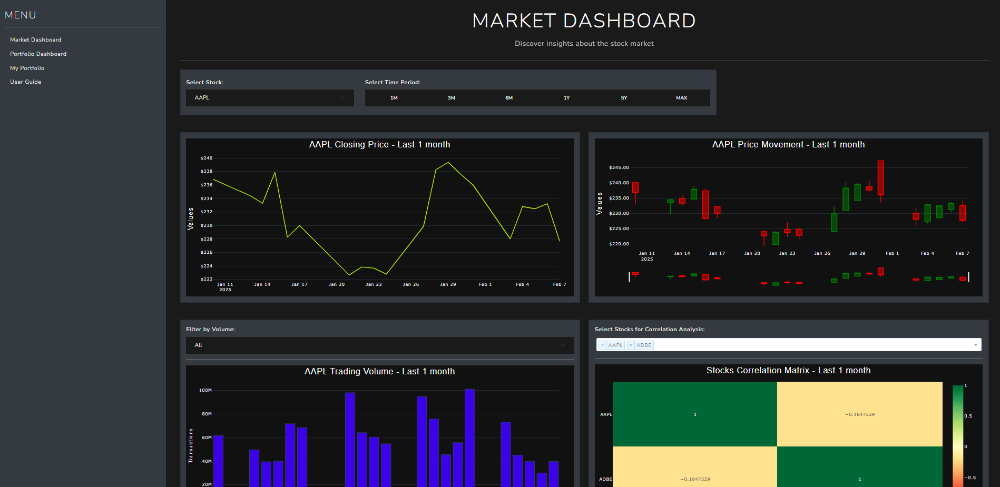

# Stock Market Analytics App

## Overview

Web dashboard built with Plotly Dash for analyzing stock market data and managing a custom portfolio. Data is fetched from Yahoo Finance using the `yfinance` API and stored in an SQLite database.



## Features

- **Market Dashboard:** Explore stock market insights with interactive line charts, candlestick charts, volume charts, and correlation heatmaps.
- **Portfolio Dashboard:** View key performance indicators (KPIs), portfolio distribution, and sector allocation.
- **Portfolio Form:** Add, edit, and delete stocks with an intuitive user interface.
- **User Guide:** Access a glossary of terms, data source information, and an overview of the dashboard sections.
- **Automated Data Updates:** Daily updates of stock data from Yahoo Finance stored in an SQLite database.
- **Responsive Design:** Built with Dash and Bootstrap for a user-friendly experience across devices.

## File Structure

- **app.py:** Initializes the Dash app, sets up routes, and registers callbacks.
- **config.py:** Contains configuration settings such as the SQLite database path and CSV file path for sector data.
- **components/**: Reusable UI components (alerts, charts, inputs, tables, etc.).
- **guide/**: Layout for the User Guide section.
- **market_dashboard/**: Layout and callback definitions for the Market Dashboard.
- **portfolio_dashboard/**: Layout and callback definitions for the Portfolio Dashboard.
- **portfolio_form/**: Layout and callback definitions for managing the custom portfolio.
- **scripts/**: Includes `init_db.py` (for initializing the SQLite database) and `update_db.py` (for updates).
- **services/**: Modules for database operations (`db.py`) and portfolio management (`portfolio.py`).
- **tests/**: Contains unit tests for portfolio services.
- **utils/**: Utility modules for callback handling, database utilities, and figure styling.

## How to Run

1. Have Python 3.7 or higher installed.
2. Install dependencies:
    ```bash
    pip install -r requirements.txt
    ```
3. Initialize the SQLite database:
    ```bash
    python scripts/init_db.py
    ```
4. Start the application:
    ```bash
    python app.py
    ```
5. Open your web browser and navigate to [http://127.0.0.1:8050](http://127.0.0.1:8050).

## Acknowledgments

- This project uses the `yfinance` library to fetch stock market data from Yahoo Finance.
- Thanks to the developers of Dash, Plotly, and other open-source libraries that made this project possible.
```